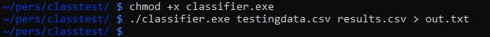
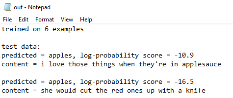

## WINDOWS RELEASE !!!

What kind of app isn't usable on Windows? Now available as the cat-themed mlcalico in the releases tab. Check out how cool it looks! UI with Javascript and Electron, compiled with Electron Build.


## Specs

A simple Naïve Bayes text classifier written in modern C++ that trains on CSV data and predicts content labels using log-probability scoring. Important to note that this implementation deviates from the usual implementation of these types of classifiers by using:

```bash
ln(1 / the total number of training material)
```

for cases where a word in the content being categorized has never been seen in the training dataset.

The classifiers in the releases are compiled for Linux distros. 


## Usage

Create a CSV file with the following format:

```bash
tag,content
label1,sample text hello hi!
label1,sample text hello hi!
label1,sample text hello hi!
label2,sample text hello hi!
label2,sample text hello hi!
label2,sample text hello hi!
```

Where "tag" and "content" should be left unchanged. Tag is the category that piece of training data belongs to, while content is the actual text. For example, if you were classifying text messages, you'd make a CSV such as:

```bash
tag,content
apples, i love apples!
apples, yeah i like the green ones better
pineapples, spiky yellow fruit from the heavens
```

Where the tag is the conversation topic, and the messages make up the content. In this case, you're trying to organize the messages by topic.

You also want a CSV of the stuff you want classified. Something as simple as:
```bash
content
text to be classified 1
text to be classified 2
text to be classified 3
```
will do fine.

The output will look something like:

```bash
test data:
predicted = <the predicted label>, log-probability score = <the probability>
content = <what was analyzed>
```

in rows. Note that the probability uses log probabilities that are always negative, so the closer to 0 the more certain the classifier was based on your data.

Download classifier.exe from the releases, put the CSV's you want the classifier to be trained on/tested on the save directory as the executable, and then run:

```bash
./classifier.exe training.csv testing.csv > resultsfileanyname.txt
```
## Acknowledgements
Classifier written by Ian Kim.
CSV handler (csvstream.hpp) written by Andrew DeOrio.


## Demo


